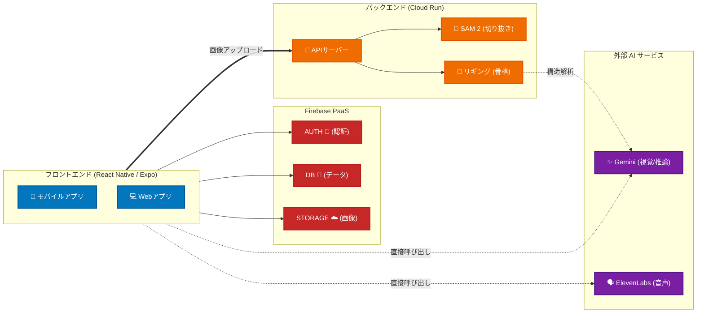
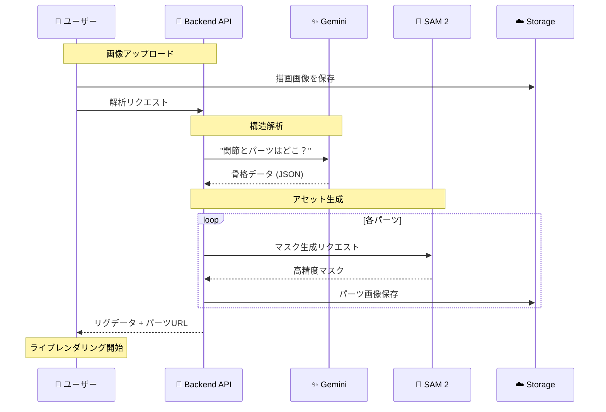
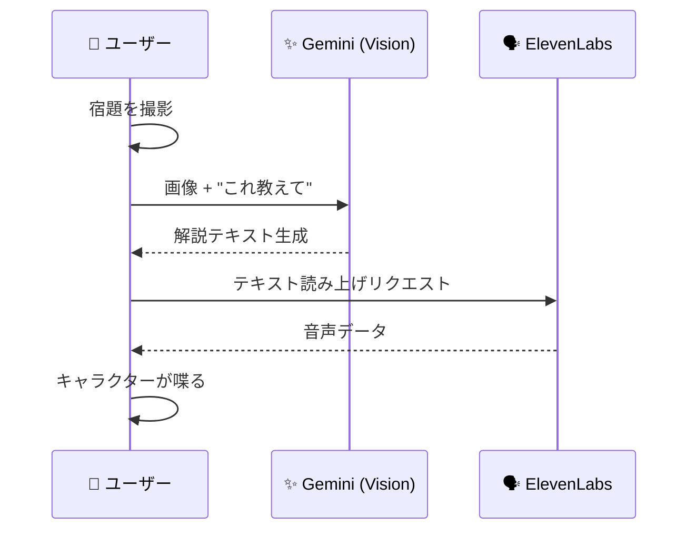

# AmiBuddy - AI 子供向け宿題アシスタント

子供の落書きをAI搭載の宿題アシスタントに変える、インタラクティブな React Native アプリです。子供たちは自分だけのキャラクターを作り、宿題をアップロードし、パーソナライズされたAIの相棒と音声で会話することができます。

[デモ動画をご覧ください](https://www.youtube.com/watch?v=IoeVV8_tQiw)
[](https://www.youtube.com/watch?v=IoeVV8_tQiw)

## 🏗️ アーキテクチャ (Architecture)

AmiBuddyは、React Native (Frontend) と Python/FastAPI (Backend) を組み合わせたハイブリッド構成です。



---

## 🔄 ワークフロー (Workflows)

### 1. キャラクター作成 ("Live Animation" Pipeline)

落書きから動くキャラクターを生成するプロセスです。**Gemini** が骨格を特定し、**SAM 2** がパーツを切り抜きます。



### 2. 宿題サポート ("Study Buddy" Pipeline)

**Gemini Vision** で問題を読み取り、**ElevenLabs** でキャラクターの声で解説します。



---

## ✨ 機能 (Features)

### 🎬 ビデオ・スプラッシュスクリーン
- アプリ起動時にプロフェッショナルなローディング動画を再生
- スムーズなフェードアウト移行

### 🎨 キャラクター作成
- 描いた絵をアップロードして、自分だけのAIキャラクターを作成
- キャラクターに名前を付ける
- キャラクターが声で自己紹介
- バウンス、呼吸、発話エフェクト付きのアニメーションキャラクター

### 📚 宿題分析
- 宿題の画像をアップロード
- AIが子供向けの日本語で宿題を分析・解説
- トピックと難易度を特定
- キャラクターによる音声解説

### 🎤 音声会話
- 声を使って宿題について質問
- Google Geminiによる音声認識（Speech-to-text）
- 宿題の文脈に沿ったAI回答
- ElevenLabsによるテキスト読み上げ（Text-to-speech）
- 吹き出し付きの会話履歴

### 🧠 記憶 & 学習 (MemU)
- エージェントメモリフレームワーク「MemU」との統合
- キャラクター作成、宿題セッション、会話の保存
- 学習の進捗とカバーしたトピックの追跡
- 文脈を考慮した応答のための関連メモリの検索

### 🎨 子供向けデザイン
- 明るく遊び心のあるカラーパレット（スカイブルー、サニーイエロー、コーラルピンク、ハッピーグリーン）
- 影付きの大きな3Dボタン
- 装飾要素（星、キラキラ）
- 明確な視覚的階層
- スムーズなアニメーション

## 🚀 クイックスタート (Quick Start)

```bash
# Install dependencies
npm install

# Start the app
npm start

# Press 'i' for iOS simulator
```

## 🛠️ 技術スタック (Technologies)

### AI & ML
- **Google Gemini 2.5 Flash** - 視覚分析と会話
- **ElevenLabs** - 日本語テキスト読み上げ
- **MemU** - エージェントメモリフレームワーク
- **SAM (Segment Anything)** - 描画のセグメンテーション

### Frontend
- **React Native** - クロスプラットフォームモバイルフレームワーク (Expo)
- **TypeScript** - 型安全なコード
- **Reanimated / Skia** - 高性能アニメーション

### Services
- 音声認識・合成による音声会話
- ビジョンAIによる画像分析
- メモリの保存と検索
- キャラクターアニメーションシステム

## 📂 プロジェクト構造 (Project Structure)

```
amibuddy/
├── src/
│   ├── screens/          # 画面コンポーネント (HomeworkUpload, CharacterCreation etc.)
│   ├── components/       # 再利用可能なコンポーネント
│   ├── services/         # APIサービス (Gemini, ElevenLabs, MemU)
│   ├── navigation/       # ナビゲーション設定
│   └── theme/            # デザインテーマ
├── animation_orchestrator/ # Pythonバックエンド (SAM 2, Rigging)
├── public/               # 静的アセット
└── app.config.js         # Expo設定
```

## 🔧 設定 (Configuration)

`.env` ファイルを作成し、APIキーを設定してください：

```env
# ElevenLabs
ELEVENLABS_API_KEY=your_key_here
ELEVENLABS_VOICE_ID=your_voice_id_here

# Google Gemini
GEMINI_API_KEY=your_key_here

# MemU
MEMU_API_KEY=your_key_here
MEMU_USER_ID=your_user_id_here
MEMU_AGENT_ID=amibuddy_homework_assistant

# SAM (Backend URL)
SAM_API_URL=https://your-cloud-run-url.run.app
SAM_API_KEY=your_key_here
```

## 📝 ライセンス

Private project

---

Made with ❤️ for children's education
