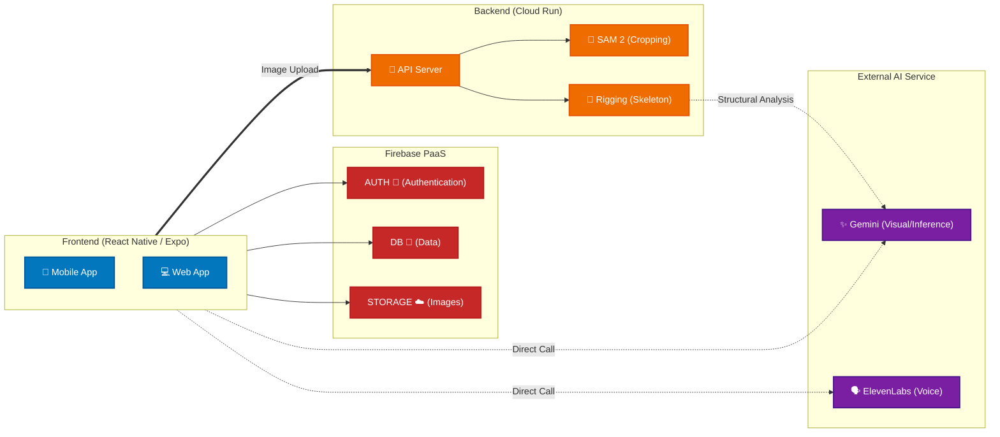
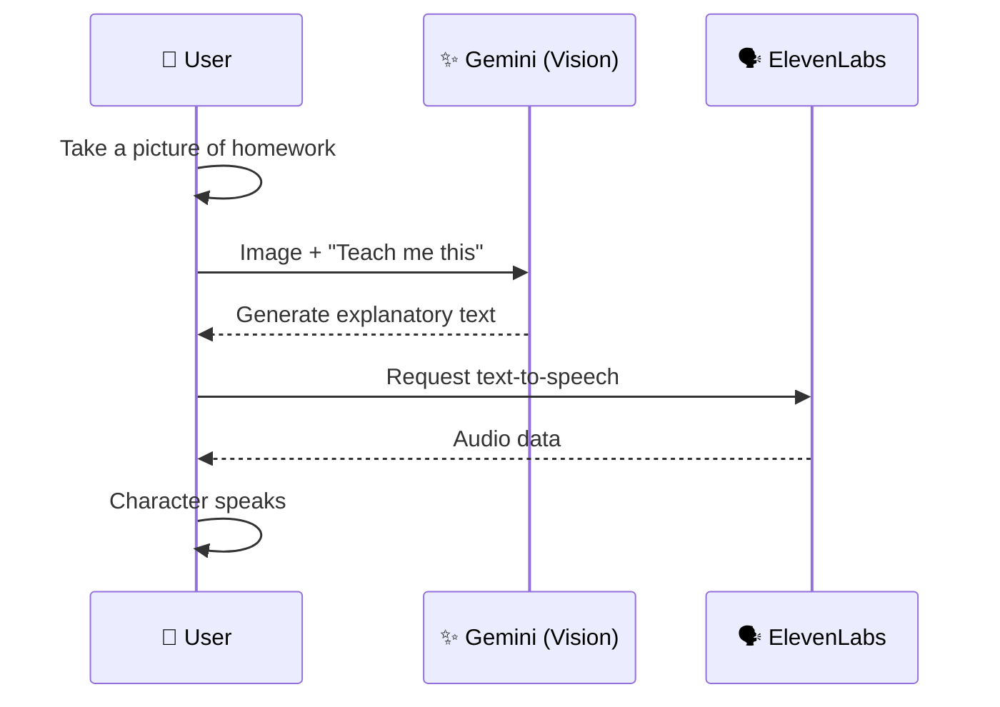

# AmiBuddy - AI Homework Assistant for Kids

AmiBuddy is an interactive React Native app that transforms children's scribbles into an AI-powered homework assistant. Children can create their own characters, upload their homework, and have voice conversations with their personalized AI companion.

[Watch the demo video](https://www.youtube.com/watch?v=IoeVV8_tQiw)
[](https://www.youtube.com/watch?v=IoeVV8_tQiw)

## 🏗️ Architecture

AmiBuddy uses a hybrid architecture combining React Native (Frontend) and Python/FastAPI (Backend).


```mermaid
graph LR
subgraph Frontend ["Frontend (React Native / Expo)"]
direction TB
MobileClient["📱 Mobile App"]
WebClient["💻 Web App"]
end
subgraph Firebase_Services ["Firebase PaaS"]
direction TB
Auth["AUTH 🔐 (Authentication)"]
Firestore["DB 📄 (Data)"]
Storage["STORAGE ☁️ (Images)"]
end
subgraph Cloud_Run ["Backend (Cloud Run)"]
direction TB
OrchestratorAPI["🚀 API Server"]
SAM2["🧩 SAM 2 (Cropping)"]
RiggingAgent["🦴 Rigging (Skeleton)"]
end
subgraph External_AI ["External AI Service"]
direction TB
Gemini["✨ Gemini (Visual/Inference)"]
ElevenLabs["🗣️ ElevenLabs (Voice)"]
end

%% Key Data Flows
Frontend --> Auth
Frontend --> Firestore
Frontend --> Storage

%% Direct AI Calls (Vision / Voice)
Frontend -.->|Direct Call| Gemini
Frontend -.->|Direct Call| ElevenLabs

%% Heavy Processing Flow
Frontend ==>|Image Upload| OrchestratorAPI

OrchestratorAPI --> SAM2
OrchestratorAPI --> RiggingAgent
RiggingAgent -.->|Structural Analysis| Gemini

%% Styling - HIGH CONTRAST DARK MODE
classDef mobile fill:#0277bd,stroke:#01579b,stroke-width:2px,color:#fff;
classDef cloud fill:#ef6c00,stroke:#e65100,stroke-width:2px,color:#fff;
classDef ai fill:#7b1fa2,stroke:#4a148c,stroke-width:2px,color:#fff;
classDef firebase fill:#c62828,stroke:#b71c1c,stroke-width:2px,color:#fff;

class MobileClient,WebClient mobile;
class OrchestratorAPI,SAM2,RiggingAgent cloud;
class Gemini,ElevenLabs ai;
class Auth,Firestore,Storage firebase;
```

---

## 🔄 Workflows

### 1. Character Creation ("Live Animation" Pipeline)

This is the process of generating a moving character from a doodle. **Gemini** identifies the skeleton, and **SAM 2** cuts out the parts. ```mermaid
sequenceDiagram
participant User as 👤 User
participant API as 🚀 Backend API
participant Gemini as ✨ Gemini
participant SAM2 as 🤖 SAM 2
participant Storage as ☁️ Storage

Note over User, API: Image Upload
User->>Storage: Save Drawing Image
User->>API: Analysis Request

Note over API, Gemini: Structural Analysis
API->>Gemini: "Where are the joints and parts?"
Gemini-->>API: Skeleton Data (JSON)

Note over API, SAM2: Asset Generation
loop Each Part
API->>SAM2: Mask Generation Request
SAM2-->>API: High-Precision Mask
API->>Storage: Save Part Image
end

API-->>User: Rig Data + Part URL
Note over User: Start Live Rendering
```

### 2. Homework Support ("Study Buddy" Pipeline)

**Gemini Vision** reads the problem, and **ElevenLabs** provides explanations in the characters' voices.


```mermaid
sequenceDiagram
participant User as 👤 User
participant Gemini as ✨ Gemini (Vision)
participant Eleven as 🗣️ ElevenLabs

User->>User: Take a picture of homework
User->>Gemini: Image + "Teach me this"
Gemini-->>User: Generate explanatory text
User->>Eleven: Request text-to-speech
Eleven-->>User: Audio data
User->>User: Character speaks
```

---

## ✨ Features

### 🎬 Video Splash Screen
- Play a professional loading video when the app starts
- Smooth fade-out transition

### 🎨 Character Creation
- Upload your drawings to create your own AI character
- Name your character
- Character introduces themselves with voice
- Animated character with bounce, breathing, and speech effects

### 📚 Homework Analysis
- Upload images of homework
- AI analyzes and explains homework in child-friendly Japanese
- Identifies topics and difficulty levels
- Voice commentary by characters

### 🎤 Voice Conversation
- Ask questions about homework using your voice
- Speech-to-text recognition by Google Gemini
- AI responses relevant to the homework context
- Text-to-speech by ElevenLabs
- Conversation history with speech bubbles

### 🧠 Memory & Learning (MemU)
- Integration with the agent memory framework "MemU"
- Character creation, homework sessions, and conversation saving
- Tracking learning progress and covered topics
- Searching relevant memories for context-aware responses

### 🎨 Kid-Friendly Design
- Bright and playful color palette (sky blue, sunny yellow, coral pink, happy green)
- Large 3D buttons with shadows
- Decorative elements (stars, glitter)
- Clear visual hierarchy
- Smooth animation
## 🚀 Quick Start

```bash
# Install dependencies
npm install
# Start the app
npm start
# Press 'i' for iOS simulator
```

## 🛠️ Technology Stack
### AI & ML
- **Google Gemini 2.5 Flash** - Visual analysis and conversation
- **ElevenLabs** - Japanese text-to-speech
- **MemU** - Agent memory framework
- **SAM (Segment Anything)** - Drawing segmentation
### Frontend
- **React Native** - Cross-platform mobile framework (Expo)
- **TypeScript** - Type-safe code
- **Reanimated / Skia** - High-performance animation
### Services
- Speech recognition and synthesis for voice conversation
- Image analysis using vision AI
- Memory storage and retrieval
- Character animation system
## 📂 Project Structure
```
amibuddy/
├── src/
│ ├── screens/ # Screen components (HomeworkUpload, CharacterCreation, etc.)
│ ├── components/ # Reusable components
│ ├── services/ # API services (Gemini, ElevenLabs, MemU)
│ ├── navigation/ # Navigation settings
│ └── theme/ # Design theme
├── animation_orchestrator/ # Python backend (SAM 2, Rigging)
├── public/ # Static assets
└── app.config.js # Expo settings
```
## 🔧 Configuration

Create a `.env` file and set your API key:
```env
# Eleven Labs
ELEVENLABS_API_KEY=your_key_here
ELEVENLABS_VOICE_ID=your voice id

# Google Gemini
GEMINI_API_KEY=your_key_here

# MemU
MEMU_API_KEY=your_key_here
MEMU_USER_ID=your_user_id_here
MEMU_AGENT_ID=amibuddy_homework_assistant

# SAM (Backend URL)
SAM_API_URL=https://your-cloud-run-url.run.app
SAM_API_KEY=your_key_here
